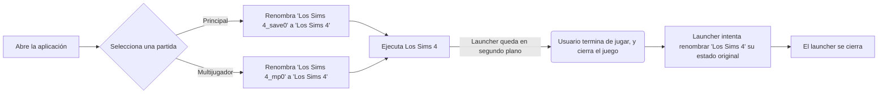

# Gestor de Guardado de Los Sims 4

Este **Launcher** está diseñado para permitirte gestionar múltiples partidas guardadas de _Los Sims 4_, cada una con distintos mods, para que puedas disfrutar de experiencias personalizadas en cada partida.

## ¿Cómo funciona?

### Flujo Explicado y Sencillo

El Launcher creará dos carpetas en el directorio de _Los Sims 4_, y las renombrará según tu elección para que el juego seleccione la carpeta correspondiente al abrirse. Es decir, si seleccionas la partida "Principal", el juego utilizará los datos de esa carpeta específica, y lo mismo sucederá si eliges la opción "Multijugador", utilizando los datos de la partida "Multijugador".

### Flujo Gráfico

## ¿Cuántas partidas puedo tener a la vez?

En la versión actual, sólo es posible gestionar una partida en solitario y otra disponible para multijugador.

En futuras actualizaciones, se agregarán más variantes del Launcher, junto con tutoriales detallados para personalizarlo a tu gusto.

Si tienes conocimientos básicos de **Batch**, probablemente te será sencillo modificar el script para agregar más opciones por ti mismo.

## ¿Perderé mis partidas?

No. Al iniciar el Launcher por primera vez, se te harán algunas preguntas para configurar y personalizar el nombre de las partidas. Esto garantiza que tus partidas estén seguras y correctamente gestionadas.

## Consideraciones Importantes

-   **No cierres el Launcher manualmente.** El Launcher se cerrará automáticamente una vez haya completado todas sus tareas.
-   **No renombres ninguna de las carpetas dentro de "Electronic Arts".** Esto podría resultar en pérdida de datos, ya que si el Launcher no encuentra la carpeta correcta, Windows podría sobreescribirla automáticamente.
-   **Protección contra cierres inesperados:** Si por accidente cierras el Launcher y la carpeta no vuelve a su estado original, el Launcher detectará esta anomalía y procederá a renombrarla automáticamente.

## Desistimiento

**Pérdida de Datos por Uso Incorrecto del Launcher**

El Launcher ha sido diseñado para ofrecer una gestión segura de tus partidas guardadas. Sin embargo, no me hago responsable de cualquier pérdida de datos que pueda ocurrir si el Launcher es modificado, utilizado de manera incorrecta o si se altera el archivo de configuración de alguna forma no prevista. El uso del Launcher bajo cualquier circunstancia implica la aceptación de los riesgos asociados, incluyendo posibles errores en la renombración de las carpetas, conflictos con otros programas o modificaciones no autorizadas.
